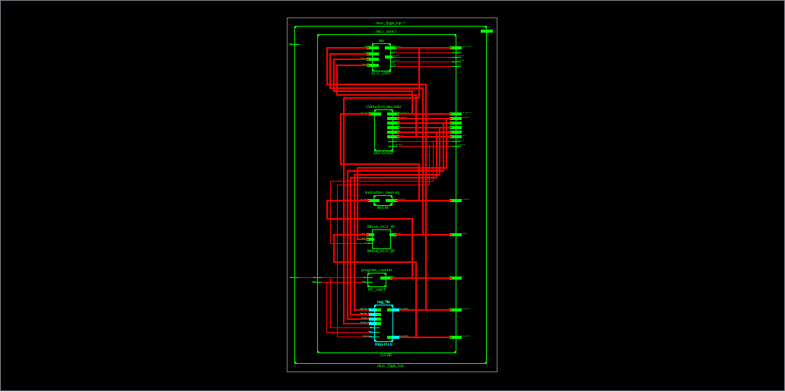
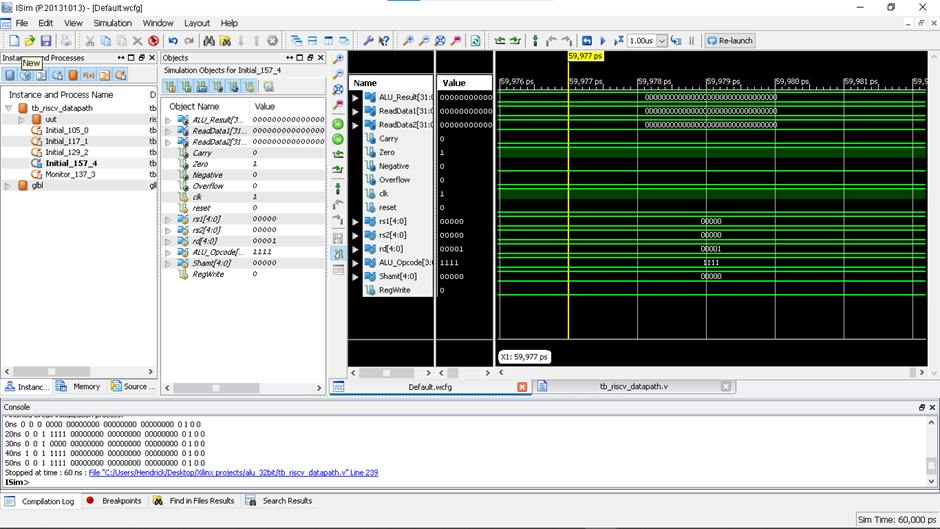
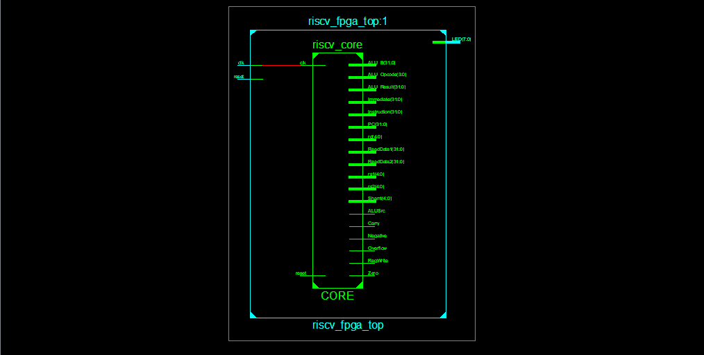
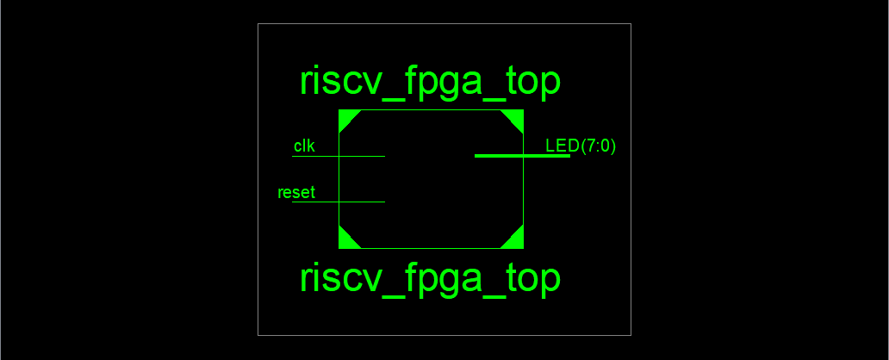
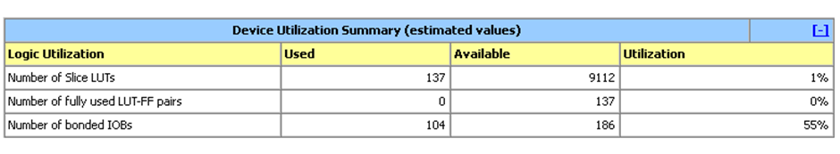
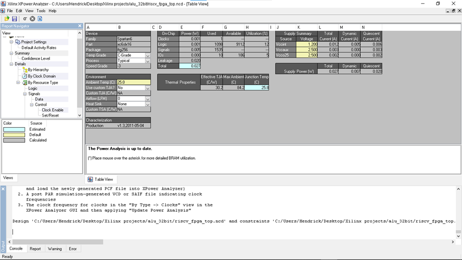

# 32-bit RISC-V Processor

A **32-bit RISC-V processor implemented in Verilog HDL at RTL level**, integrating a 32-bit ALU, instruction decoder, instruction memory, program counter, register file, datapath, and execute/write-back logic. The design was simulated using Xilinx ISim and synthesized/analyzed for a **Xilinx Spartan-6 XC6SLX16 FPGA**.

## 📌 Project Overview

This project focuses on the hardware implementation of a RISC-V-based processor using modular RTL design. The processor is organized around a central `riscv_core` and includes dedicated modules for instruction processing, arithmetic/logic operations, register access, program sequencing, and FPGA interfacing.

The project demonstrates:

- 32-bit RTL processor design
- RISC-V-oriented instruction decoding
- Datapath and control-signal integration
- 32-bit ALU implementation
- Register-file based operand handling
- Instruction-memory and program-counter logic
- Verilog testbench-based simulation
- FPGA synthesis and device-utilization analysis
- Power estimation using Xilinx XPower Analyzer

---

## 🎯 Objectives

1. Design a 32-bit RISC-V processor using Verilog HDL.
2. Develop a modular processor datapath and control structure.
3. Implement a 32-bit ALU for arithmetic and logical operations.
4. Implement instruction decoding and processor control signals.
5. Integrate registers, instruction memory, program counter, and execution logic.
6. Verify individual modules and processor-level behavior using simulation.
7. Analyze FPGA resource utilization and estimated power consumption.

---

## 🏗️ Architecture

The processor is organized around the following major RTL blocks:

```text
                         ┌─────────────────────┐
                         │   Instruction       │
                         │      Memory         │
                         └──────────┬──────────┘
                                    │
                                    ▼
                         ┌─────────────────────┐
                         │ Instruction Decoder │
                         │    / Control Logic  │
                         └──────────┬──────────┘
                                    │
                 ┌──────────────────┼──────────────────┐
                 │                  │                  │
                 ▼                  ▼                  ▼
          ┌────────────┐     ┌──────────────┐   ┌──────────────┐
          │ Register   │     │ Immediate /  │   │ Control      │
          │ File       │     │ Operand Logic │   │ Signals      │
          └─────┬──────┘     └──────┬───────┘   └──────────────┘
                │                   │
                └─────────┬─────────┘
                          ▼
                   ┌──────────────┐
                   │   32-bit ALU │
                   └──────┬───────┘
                          │
                          ▼
                   ┌──────────────┐
                   │ Execute /    │
                   │ Write Back   │
                   └──────────────┘
                          │
                          ▼
                   ┌──────────────┐
                   │ Register File│
                   └──────────────┘

                 ┌──────────────────┐
                 │ Program Counter  │
                 └────────┬─────────┘
                          │
                          └──► Instruction flow
```

### Processor hierarchy

The FPGA top-level module is:

```text
riscv_fpga_top
       │
       └── riscv_core
              ├── ALU
              ├── Instruction Decoder
              ├── Instruction Memory
              ├── Program Counter
              ├── Register File
              ├── Datapath
              ├── Execute / Write-Back logic
              └── Multiplexer / control logic
```

---

## ⚙️ Main RTL Modules

| Module | Function |
|---|---|
| `alu.v` | Performs 32-bit arithmetic and logical operations |
| `instruction_decoder.v` | Decodes instruction fields and generates control information |
| `instruction_memory.v` | Provides instructions to the processor |
| `program_counter.v` | Maintains and updates the instruction address |
| `reg_file.v` | Provides processor register storage and read/write access |
| `riscv_datapath.v` | Connects major datapath elements and control signals |
| `riscv_execute_wb.v` | Handles execution and write-back related logic |
| `riscv_core.v` | Integrates the processor components |
| `riscv_fpga_top.v` | FPGA-oriented top-level wrapper |

> The exact instruction set and supported operations are determined by the RTL implementation in this repository.

---

## 🧮 32-bit ALU

The ALU is a central execution unit of the processor.

The RTL exposes signals including:

- `ALU_Result`
- `ALU_Op`
- `ReadData1`
- `ReadData2`
- `Carry`
- `Zero`
- `Negative`
- `Overflow`
- `RegWrite`

These signals are used to observe and control ALU execution during simulation.

---

## 🔄 General Instruction Flow

The processor follows a modular instruction-processing flow:

```text
Instruction Fetch
        ↓
Instruction Decode
        ↓
Register / Immediate Operand Selection
        ↓
ALU / Execution
        ↓
Result Generation
        ↓
Write Back
        ↓
Next Instruction
```

The program counter controls instruction sequencing while the decoder and datapath generate the required control and data paths.

---

## 🧪 Verification & Simulation

Individual RTL modules and processor blocks are verified using Verilog testbenches.

Example testbench files include:

```text
tb_alu.v
tb_instruction_decoder.v
tb_riscv_core.v
tb_riscv_datapath.v
tb_riscv_execute_wb.v
```

### Simulation tool

**Xilinx ISim**

The simulation waveform captures internal processor signals such as:

- Clock and reset
- ALU result
- ALU operation
- Register read data
- Register addresses
- Immediate value
- Carry
- Zero
- Negative
- Overflow
- Register-write control

---

## 📊 FPGA Implementation

The design was synthesized/analyzed for:

```text
FPGA Family : Spartan-6
Device      : XC6SLX16
Package     : TQG256
Speed Grade : -3
```

### Device Utilization

| Resource | Used | Available | Utilization |
|---|---:|---:|---:|
| Slice LUTs | 137 | 9112 | 1% |
| Fully Used LUT-FF Pairs | 0 | 137 | 0% |
| Bonded IOBs | 104 | 186 | 55% |

The design uses a small portion of the available LUT resources, while the reported I/O utilization is higher because of the FPGA top-level interface.

---

## ⚡ Power Analysis

Power estimation was performed using **Xilinx XPower Analyzer**.

### Estimated Power

| Parameter | Value |
|---|---:|
| Total Power | **0.027 W** |
| Dynamic Power | **0.007 W** |
| Quiescent Power | **0.020 W** |
| Ambient Temperature | **25°C** |

### Supply Voltages

| Supply | Voltage |
|---|---:|
| Vccint | 1.20 V |
| Vccaux | 2.50 V |
| Vcco | 2.50 V |

> Power values are estimated tool results and depend on the selected device, constraints, switching activity, and analysis conditions.

---

## 📈 Results

### ALU Simulation

The simulation waveform shows ALU-related outputs and status signals including result, carry, zero, negative, overflow, and control signals.



### RTL Datapath Simulation



### Processor RTL Hierarchy



### FPGA Top-Level Hierarchy



### Device Utilization



### Power Analysis



---

## 🛠️ Tools & Technologies

- **Verilog HDL**
- **RTL Design**
- **RISC-V Architecture**
- **Xilinx ISE**
- **Xilinx ISim**
- **Xilinx XPower Analyzer**
- **FPGA Synthesis**
- **Spartan-6 FPGA**

---

## 📁 Repository Structure

```text
32-bit-RISC-V-Processor/
│
├── README.md
│
├── rtl/
│   ├── alu.v
│   ├── instruction_decoder.v
│   ├── instruction_memory.v
│   ├── program_counter.v
│   ├── reg_file.v
│   ├── riscv_datapath.v
│   ├── riscv_execute_wb.v
│   ├── riscv_core.v
│   ├── riscv_fpga_top.v
│   └── ...
│
├── testbench/
│   ├── tb_alu.v
│   ├── tb_instruction_decoder.v
│   ├── tb_riscv_datapath.v
│   ├── tb_riscv_execute_wb.v
│   ├── tb_riscv_core.v
│   └── ...
│
├── simulation/
│   └── ...
│
├── docs/
│   └── ...
│
└── results/
    ├── alu_simulation.png
    ├── riscv_datapath_simulation.png
    ├── riscv_core_hierarchy.png
    ├── riscv_fpga_top.png
    ├── device_utilization.png
    └── power_analysis.png
```

---

## 🚀 Future Enhancements

- Expand the supported RISC-V instruction subset.
- Implement a complete RV32I-compatible instruction set.
- Add pipelining for improved throughput.
- Implement hazard detection and data forwarding.
- Add instruction and data cache support.
- Improve verification with automated test vectors.
- Perform timing analysis and optimization.
- Implement and test the processor on a physical FPGA board.
- Explore area, timing, and power optimization.

---

## 📚 Learning Outcomes

This project provided practical experience in:

- RISC-V processor architecture
- Verilog RTL coding
- Digital datapath design
- ALU design
- Instruction decoding
- Register-file implementation
- Control-signal generation
- Hardware simulation
- FPGA synthesis
- Resource utilization analysis
- Power estimation
- Hardware verification

---

## 👨‍💻 Author

**Hari Prasath V**

Electronics and Communication Engineering

---

## ⭐ Project Highlights

```text
32-bit RISC-V Processor
        │
        ├── Verilog RTL
        ├── Modular Datapath
        ├── 32-bit ALU
        ├── Instruction Decoder
        ├── Register File
        ├── FPGA Synthesis
        ├── ISim Verification
        ├── Resource Analysis
        └── Power Estimation
```
